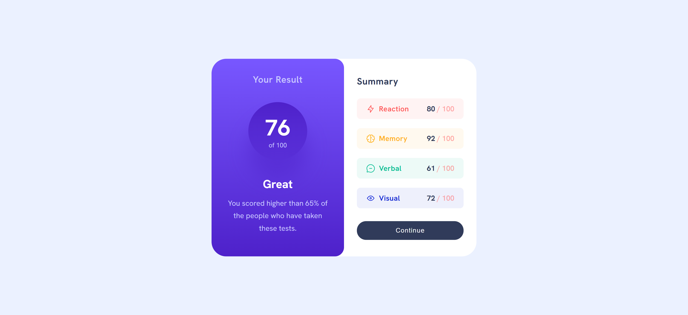

# Results Summary Component

A responsive results summary card built with Svelte 5, displaying test scores across multiple categories. This project features a modern gradient design, dynamic data fetching, component-based architecture, and a clean split-card interface that adapts seamlessly across all devices.

## Preview

The component displays an intuitive split-card interface featuring:

- Circular score display with gradient background
- Personalized feedback based on performance
- Four category breakdown (Reaction, Memory, Verbal, Visual)
- Color-coded category items with matching icons
- Interactive continue button with hover effects
- Smooth transitions and modern styling
- Fully responsive mobile-first design

### Project Preview



## Features

- 🎨 Modern gradient design with glassmorphism effects
- 📱 Fully responsive across Desktop and Mobile breakpoints
- ⚡ Svelte 5 Runes syntax (`$state`, `$props`, `$effect`)
- 🧩 Component-based architecture with clean separation
- 🎯 Dynamic data fetching from JSON
- 💫 Smooth CSS transitions and hover states
- 🔤 Google Fonts integration (Hanken Grotesk)
- ♿ Semantic HTML structure
- 📦 Scoped component styling (no CSS conflicts)
- 🎨 Color-coded category indicators
- 🔄 Reactive state management
- 📐 CSS Grid layout system

## Technologies Used

- Svelte 5
- CSS3 (CSS Grid & Flexbox)
- JavaScript (ES6+)
- Google Fonts (Hanken Grotesk)

## Project Structure

```
project-root/
│
├── src/
│   ├── App.svelte              # Main app container
│   ├── ResultCard.svelte       # Overall score display
│   ├── SummaryCard.svelte      # Category list container
│   ├── SummaryItem.svelte      # Individual category row
│   └── app.css                 # Global styles
├── public/
│   └── assets/
│       ├── data.json           # Category scores data
│       ├── icon-reaction.svg   # Reaction category icon
│       ├── icon-memory.svg     # Memory category icon
│       ├── icon-verbal.svg     # Verbal category icon
│       └── icon-visual.svg     # Visual category icon
├── package.json
└── README.md
```

## Design Specifications

### Colors

#### Result Card (Left Panel)

- **Background Gradient Top**: `hsl(252, 100%, 67%)` - Light slate blue
- **Background Gradient Bottom**: `hsl(256, 72%, 46%)` - Violet blue
- **Circle Gradient Top**: `hsla(256, 72%, 46%, 1)` - Violet blue
- **Circle Gradient Bottom**: `hsla(256, 72%, 46%, 0.5)` - Violet blue (50% opacity)
- **Primary Text**: `hsl(0, 0%, 100%)` - White
- **Secondary Text**: `hsl(241, 100%, 89%)` - Light lavender

#### Summary Card (Right Panel)

- **Background**: `hsl(0, 0%, 100%)` - White
- **Title Text**: `hsl(224, 30%, 27%)` - Dark navy
- **Score Text**: `hsl(224, 30%, 27%)` - Dark navy
- **Score Suffix**: `hsla(0, 100%, 67%, 0.5)` - Light red (50% opacity)

#### Category Colors

- **Reaction**: `hsl(0, 100%, 67%)` - Light red
- **Reaction Background**: `hsla(0, 100%, 67%, 0.07)` - Light red (7% opacity)
- **Memory**: `hsl(39, 100%, 56%)` - Orangey yellow
- **Memory Background**: `hsla(39, 100%, 56%, 0.07)` - Orangey yellow (7% opacity)
- **Verbal**: `hsl(166, 100%, 37%)` - Green teal
- **Verbal Background**: `hsla(166, 100%, 37%, 0.07)` - Green teal (7% opacity)
- **Visual**: `hsl(234, 85%, 45%)` - Cobalt blue
- **Visual Background**: `hsla(234, 85%, 45%, 0.07)` - Cobalt blue (7% opacity)

#### Button Colors

- **Button Default**: `hsl(224, 30%, 27%)` - Dark navy
- **Button Hover**: `hsla(256, 72%, 46%, 1)` - Violet blue
- **Button Text**: `hsl(0, 0%, 100%)` - White

#### Page Background

- **Page Background**: `hsl(221, 100%, 96%)` - Pale blue

### Typography

- **Font Family**: Hanken Grotesk (Google Fonts, Sans-serif)
- **Base Font Size**: 16px (1.6rem with 62.5% html base)
- **Result Title**: 20px (2rem), weight: 600
- **Final Score**: 49px (4.9rem), weight: 700
- **Max Score**: 14px (1.4rem), weight: 400
- **Comment Title**: 25px (2.5rem), weight: 700
- **Comment Description**: 16px (1.6rem), weight: 400, line-height: 1.7
- **Summary Title**: 20px (2rem), weight: 700
- **Category Title**: 16px (1.6rem), weight: 600
- **Category Score**: 16px (1.6rem), weight: 600
- **Score Value**: 16px (1.6rem), weight: 700
- **Button Text**: 14px (1.4rem), weight: 500

### Layout

#### Desktop (>620px)

- **Container Max Width**: 640px (64rem)
- **Container Margin**: 128px auto (12.8rem)
- **Container Padding**: 0 32px (3.2rem)
- **Grid Layout**: 2 equal columns (result | summary)
- **Card Border Radius**: 32px (3.2rem)
- **Result Card Padding**: 32px (3.2rem)
- **Summary Card Padding**: 36px 28px (3.6rem 2.8rem)
- **Score Circle Size**: 128px (12.8rem)
- **Score Circle Padding**: 24px 36px (2.4rem 3.6rem)

#### Mobile (≤620px)

- **Container Max Width**: 320px (32rem)
- **Container Padding**: 0
- **Container Margin**: 128px auto
- **Grid Layout**: Single column (stacked)
- **Result Card Padding**: 32px 12px (3.2rem 1.2rem)
- **Result card on top**
- **Summary card below**

### Component Specifications

#### Score Circle

- **Size**: 128px × 128px
- **Border Radius**: 50% (perfect circle)
- **Box Shadow**: `0 40px 40px hsla(256, 72%, 46%, 0.5)`
- **Gradient**: Top violet to bottom transparent violet

#### Summary Items

- **Border Radius**: 8px (0.8rem)
- **Padding**: 12px 20px (1.2rem 2rem)
- **Gap Between Items**: 20px (2rem)
- **Icon Gap**: 8px (0.8rem)

#### Continue Button

- **Width**: 100%
- **Padding**: 12px 24px (1.2rem 2.4rem)
- **Border Radius**: 20px (2rem)
- **Border**: none
- **Cursor**: pointer

## Data Format

The component expects a `data.json` file in the assets folder:

```json
[
  {
    "category": "Reaction",
    "score": 80,
    "icon": "./assets/icon-reaction.svg"
  },
  {
    "category": "Memory",
    "score": 92,
    "icon": "./assets/icon-memory.svg"
  },
  {
    "category": "Verbal",
    "score": 61,
    "icon": "./assets/icon-verbal.svg"
  },
  {
    "category": "Visual",
    "score": 72,
    "icon": "./assets/icon-visual.svg"
  }
]
```

## Svelte 5 Features Used

### Reactive State with `$state`

```javascript
let summaryList = $state([]);
```

**Features:**

- Declares reactive state variable
- Automatically triggers re-renders on change
- Replaces Svelte 4's `let` reactivity

### Props with `$props`

```javascript
const { icon, category, score } = $props();
```

**Features:**

- Destructures component props
- Cleaner syntax than Svelte 4's `export let`
- Type-safe prop declarations

### Side Effects with `$effect`

```javascript
$effect(() => {
  fetchData();
});
```

**Features:**

- Runs on component mount
- Handles async data fetching
- Replaces Svelte 4's `onMount` for reactive effects

### Dynamic CSS Classes

```svelte
<li class="summary-item item--{category.toLowerCase()}">
```

**Features:**

- Template literal syntax for dynamic classes
- Lowercase transformation for CSS matching
- Enables category-specific styling

### Spread Props

```svelte
<SummaryItem {...summaryItem} />
```

**Features:**

- Passes all object properties as individual props
- Clean, concise syntax
- Reduces boilerplate code

## Component Architecture

### App.svelte (Container)

- Main wrapper component
- Imports and composes child components
- Handles overall layout grid
- Applies responsive breakpoints

### ResultCard.svelte (Left Panel)

- Displays overall score in circular design
- Shows performance feedback message
- Gradient background styling
- Currently uses static values (refactor opportunity)

### SummaryCard.svelte (Right Panel)

- Fetches data from JSON file
- Manages summary list state
- Renders SummaryItem components
- Contains continue button

### SummaryItem.svelte (List Item)

- Receives props via `$props()`
- Displays category icon, name, and score
- Applies category-specific colors
- Reusable for any category type

## Key CSS Techniques Used

- **CSS Grid**: Two-column card layout system
- **Flexbox**: Score circle and item alignment
- **Linear Gradients**: Result card and score circle backgrounds
- **REM Units**: Scalable, accessible typography (62.5% base)
- **Media Queries**: Responsive breakpoint at 620px
- **Scoped Styles**: Component-level CSS encapsulation
- **Box Shadow**: Depth effect on score circle
- **Border Radius**: Rounded cards and buttons
- **HSL/HSLA Colors**: Consistent color system with opacity
- **Hover Effects**: Interactive button feedback
- **Overflow Hidden**: Clean card edge clipping

## Responsive Breakpoints

The component uses a mobile-first approach with one breakpoint:

1. **Desktop**: Above 620px - Two-column grid layout
2. **Mobile**: Below 620px - Single column stacked layout

## Accessibility Features

- Semantic HTML structure with proper heading hierarchy
- Alt text for category icons
- Sufficient color contrast (WCAG AA compliant)
- Focus states on interactive elements
- Readable font sizes and line heights
- Clear visual hierarchy

## Future Improvements

- [ ] Calculate overall score from category averages
- [ ] Pass score data to ResultCard as props
- [ ] Add loading state during data fetch
- [ ] Implement error handling for failed fetches
- [ ] Replace `$effect` with `onMount` for initial data load
- [ ] Add animations for score reveal
- [ ] Make feedback message dynamic based on score
- [ ] Add unit tests for components

## Credits

This project is a solution for a Frontend Mentor challenge, designed to practice Svelte 5's new runes syntax and component-based architecture through building a responsive results summary interface.

## License

This project is open source and available for personal and educational use.

---

**Built with ❤️ using Svelte 5, CSS Grid, and modern component architecture**
